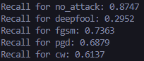

# AI-Attack-Prevention-Tool

## Introduction
This is a website that can detect the most common cyber attacks on Convolutional Neural Networks (CNNs) which are FGSM (Fast Gradient Sign Method), PGD (Projected Gradient Descent), C&amp;W (Carlini &amp; Wagner), DeepFool.

The website can be found [here](https://ai-attack-prevention-tool-website.vercel.app/)

The goal of this project was to build a model that can detect if an image supplied to ResNet34 has been attacked and by which method it has been attacked by. For this project the most common attacks were considered (FGSM, PGD, C&W, and DeepFool).

This is the main repository that contains the dataset, the data processing pipeline, as well as the model weights itself that can be used to train/evaluate the model.

There are 2 other repositories that contain the [NextJs Front-end](https://github.com/laxman-22/AI-Attack-Prevention-Tool-Website) code and the [Python Flask Server](https://github.com/laxman-22/AI-Attack-Prevention-Tool-Backend).

## Data Pipeline

The dataset used to build this model is a subset of the Image-Net-1k dataset. In order to get access to it, it must be requested [here](https://image-net.org/).

Once the dataset has been acquired, the next step is to generate adversarial examples.

The first step to generate the attacked training images, ```take_samples.py``` in the ```Data Preparation``` directory can be ran to take a certain number of images from each class in order to introduce diversity while not using every single image from ImageNet.

Next, the ```data_prep.py``` can be ran and adapted to generate the attacked images. It is set up for DeepFool, but it can be adapted for all the attacks simply by changing the following line in the file.

```python
attacked = deep_fool(model, image_tensor, torch.tensor([label], device=device), overshoot, iterations)
```

Finally, the dataset can be split into training and validation sets by running the ```splitdata.py``` file.

Overall, approximately 3000 images from around 200 classes were used to train the model. In retrospect, this may not have been sufficient based on the performance below, however it was way too computationally expensive to curate the dataset.

**Note:** The dataset curated for this project is not publicly accessible due to the distribution limitations of ImageNet images. Therefore, if you would like access to the dataset, please reach out to me at aryanlaxmansirohi@gmail.com

## Model
The model used to detect attacks on ResNet34 model is a fine tuned ResNet50 model. ResNet50 was used as some of the attack methods such as DeepFool perform small perturbations in images in order to attack models. For that reason, high resolution images were used and ResNet50 with 50 layers to detect these small changes.

## Performance

Below, the fine-tuned ResNet50 model created for this project has been evaluated primarily on recall as it clearly shows what percentage of attacks are caught by the model.



It is clear that there is significant room for improvement, which is likely due to the nature of the attacks, as they are quite hard to detect, notably DeepFool and the model might not be complex enough to capture the small perturbations in the input images.